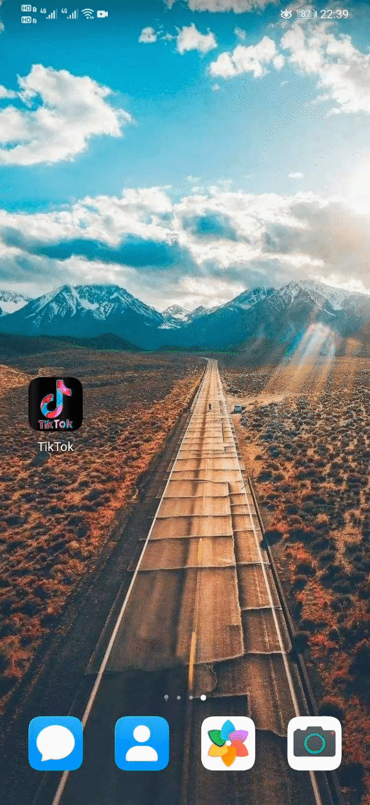

# MiniTikTok

First of all, I would like to thank my partner [ZimuSama](https://github.com/ZimuSama).

Next I will show part of the functions of `MiniTikTok` in turn.

* Click the app icon to enter MiniTikTok, the start screen displays 3s.

* The bottom layer of the homepage is the `TabLayout` navigation bar. The homepage supports pull-down refresh, using the API provided by `ByteDance` to pull the videos uploaded by students before.

* The top page of the homepage is composed of `viewpager`. By sliding the main page, you can see your previous upload. This operation is mainly achieved by comparing the uploaded `id`. Of course, support pull-down refresh.

* If you particularly like someone's video, you can search for his name and the video uploaded by him will appear. It doesn’t matter if you don’t remember clearly, we support fuzzy queries, such as typing `k` to search for videos uploaded by all users with username `k`

* The video supports progress bar control. If you particularly like a video, a small red heart will appear when you double-click. This is the characteristic of vibrato. We mainly implement it through [Lottie animation](https://github.com/airbnb/lottie-web).

* The camera supports the preview function of video recording. Regarding the animation selection when uploading, we default to the first frame of the video. If you want to choose your own cover, we provide the option to select the cover from the album.

* Switch to the message page through the tab bar at the bottom. This part is composed of two `RecyclerView`. Of course, this part is just a page.

