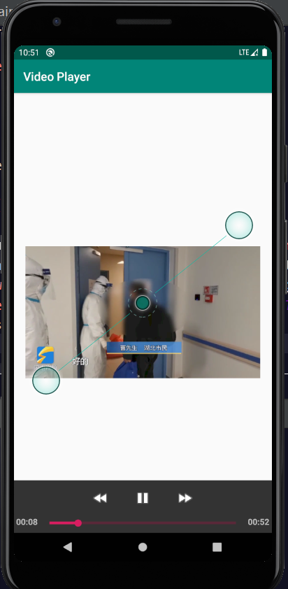

## Video Play App

* Using Glide to display web pictures
	* A placeholder image during loading and when loading fails
	* picture round angle

* Playing Internet video
	* play and pause
	* Play progress bar display (including time display)
	* The progress bar can click, slide, jump to the specified position (optional)

